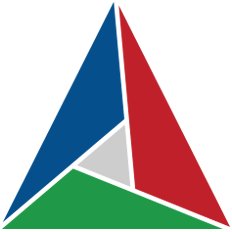

Hello there, I'm Nils 👋
============================

Hi, I'm Nils, a 16 y/o aspiring developer from Sweden 🇸🇪.

### 😈 Proficient in:

<code></code>
<code></code>
<code></code>
<code></code>
<code></code>
<code></code>
<code></code>

---

### 🤔 Learning:

<code></code>
<code></code>
<code></code>
<code></code>
<code></code>

---

### 📞 How to reach me:

### 📊 Github Stats:
|  |  |
| ----------- | ----------- |
